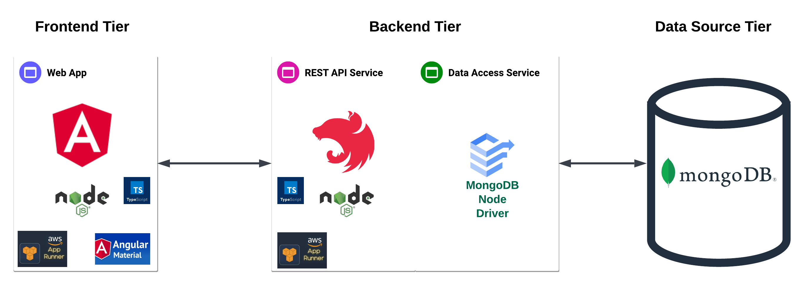
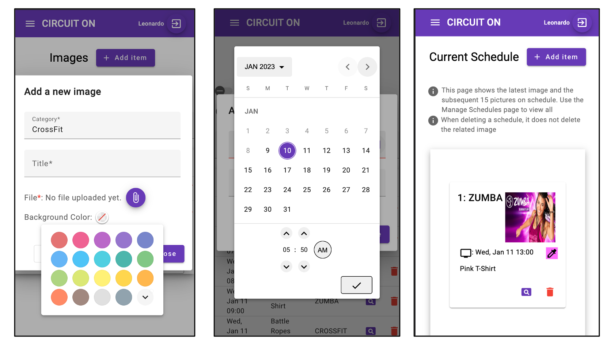

# 🌐 CIRCUIT ON

See application structure on the image below:



This is the Frontend application. This project depends on APIs provided by the Backend application.
For Backend application, please go to [https://github.com/leogomesdev/circuit-on-backend](https://github.com/leogomesdev/circuit-on-backend)

## 📚 Description

CIRCUIT ON allows you to manage images for displaying on TV based on a schedule. This is super useful for Gyms that need to display different images simultaneously on multiple TVs.

The idea for this app is to save time: it would not be required to manually switch the pictures on different TVs. Instead, use this app to upload the images and set a schedule. On the TV, open the view page on the native Internet Browser. The image on the view page will be automatically replaced by the next images at the specified date and time.

## 📲 Main technologies used

- [Angular CLI](https://github.com/angular/angular-cli) version 15.0.1
- [OKTA](https://developer.okta.com) for Authentication
- [Commitizen command line tool](https://github.com/commitizen/cz-cli)
- [Conventional Commits specification](https://www.conventionalcommits.org/en/v1.0.0/)

## 💡 Requirements

You must create an OKTA Application (for Authentication). Follow [this doc for instructions](docs/okta.md), to get your **Client Id** and **Domain/Issuer**

### 💻 For local usage:

- [Node.js](https://nodejs.org) (v16 or v18)
- [npm](https://www.npmjs.com)

## 🚀 Running

### 💻 Locally

- Be sure to install the [requirements](#requirements)

  - If you have [nvm - Node Version Manager](https://github.com/nvm-sh/nvm) installed, you could just run `nvm install` and it will install the correct version of Node.js based on file `.nvmrc`

- Create enviroment variables.

  - If using unix (Linux/MacOS), file below is helpful for creating those:
    - Copy sh file:
      ```bash
        cp -v docs/scripts/create-local-envs-unix.example.sh create-local-envs-unix.sh
      ```
    - Edit values for variables at create-local-envs-unix.sh
    - Execute script
      ```bash
        source create-local-envs-unix.sh
      ```

- Install dependencies:

  ```bash
    npm install
  ```

- Start the application:

  ```bash
    ng serve
  ```

### ☁ Production Environment

For compatibility with TV browsers, which are very limited, it is required to deploy this app using Server Side Rendering instead of Client Side Rendering.

Follow [this doc for instructions](docs/deploy-aws-runner.md)

## 🔗 Usage

After signing in using an okta valid user, the usage of the website is pretty simple:

1. Upload images
2. Set a schedule for desired images
3. Preview on the Current Schedule page
4. Open view page on TV native Internet/Browser



Please refer to the [user manual for all instructions](docs/user-manual-v1.pdf)

### 👀 TL;DR

1. Navigate to Home Page, sign using Okta, and follow instructions on screen
