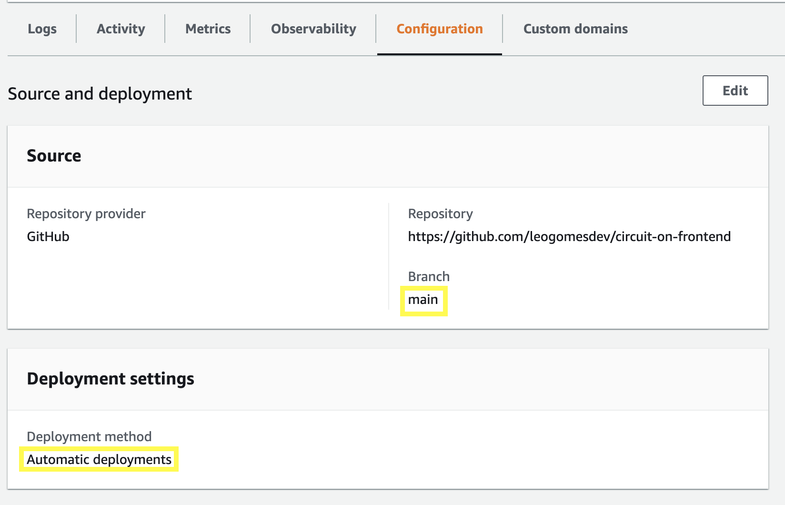

# 🌐 CIRCUIT ON (Frontend)

It is required to deploy this app as Server Side Rendering.
The deployment will be similar to an Express Node.js backend app.

## ☁ Using AWS App Runner

1. Login into your AWS Account and setup the new application
2. Follow the simple steps provided by the wizard on the screen
3. You can config as **automatic deployment**, then when a pull request is approved, it automatically triggers a new deployment for the latest code version

   

4. Set the **Build Settings** as below:

- Build command:

  ```bash
    export NG_APP_BACKEND_BASE_URL="https://REPLACE_YOUR_BACK_URL" && export NG_APP_IMAGE_CATEGORIES="CrossFit,Zumba,Private Session,Other" && export NG_APP_OKTA_ISSUER="https://dev-REPLACE.okta.com/oauth2/default" && export NG_APP_OKTA_CLIENT_ID="REPLACE" && export NG_APP_OKTA_REDIRECT_URI="https://REPLACE_YOUR_FRONT_URL/login/callback" && export NG_APP_VIEW_PAGE_FUTURE_ITEMS="4" && export NG_APP_LIST_PAGE_FUTURE_ITEMS="15" && export NG_APP_SCHEDULES_LIST_DISPLAY_ONLY_FUTURE="false" && npm install && npm run build:ssr
  ```

  - Please replace values as indicated above.

- Start command:

  ```bash
    npm run serve:ssr
  ```

- Port:

  ```bash
    4000
  ```

### 📝 Docs and external resources:

- [Docs: Deploying a new application version to App Runner](https://docs.aws.amazon.com/apprunner/latest/dg/manage-deploy.html)
