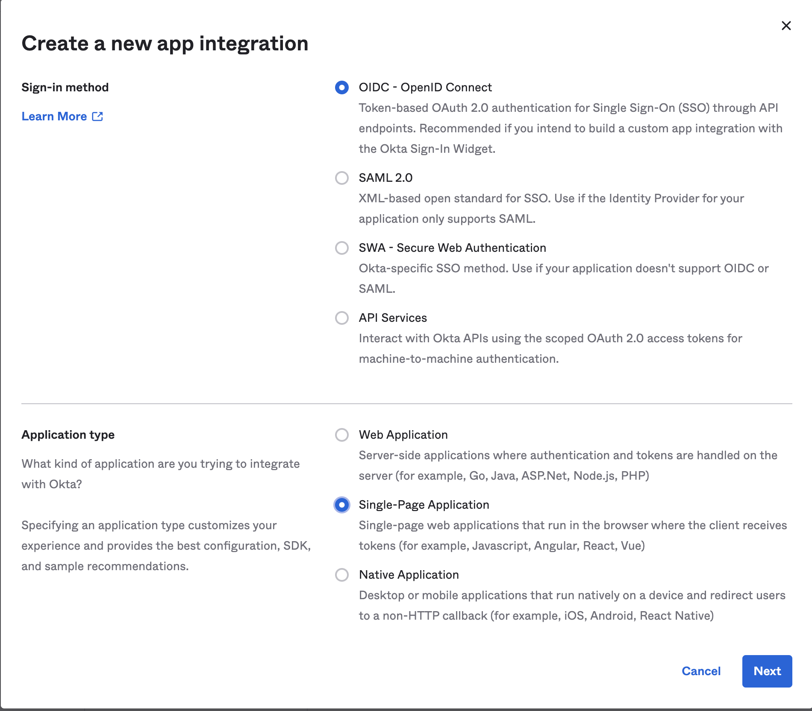
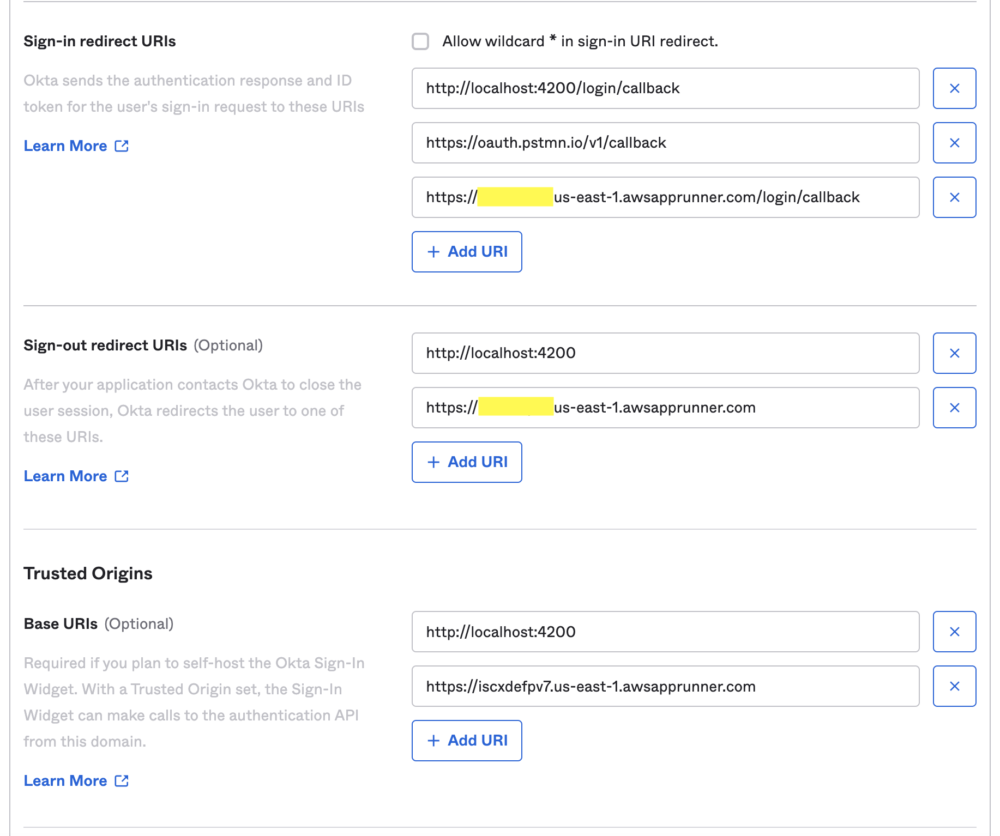
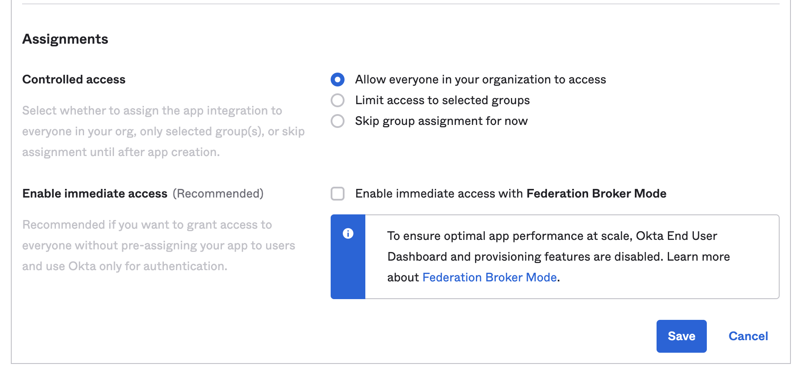
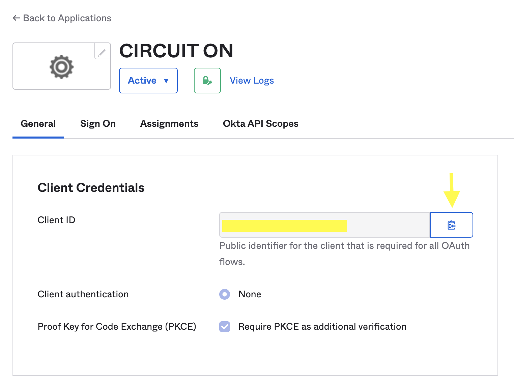

# 🌐 CIRCUIT ON

## 📚 Creating OKTA Project

1. Create your free account at [https://developer.okta.com](https://developer.okta.com)
   - When creating your account, OKTA will provide your **Okta Domain URL**
2. Go to Left Menu > Applications > Applications and click on "Create App Integration"
   
3. Select the options below:
   
4. Add URIs as below:
   
5. Configure assignments as desired. Example:
   
6. After creating it, copy your **Client ID**
   

### 📝 Docs and external resources:

- [Docs: Add user authentication to your Angular app](https://developer.okta.com/code/angular/)
